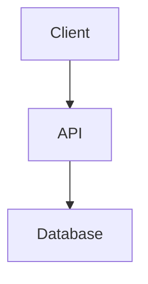

# Features Summary - AI-Powered Software Architect

## ✅ All Requested Features Implemented

### 1. ✅ Google Authentication

- **Google OAuth Integration** using `@react-oauth/google`
- Secure login/logout functionality
- Session persistence with localStorage
- Protected routes that redirect to login if not authenticated
- User profile display with avatar

### 2. ✅ Project Management

- **Create Projects**: Users can create multiple projects
- **View Projects**: Dashboard shows all projects in a card grid
- **Delete Projects**: Remove projects with confirmation
- **Project Navigation**: Click to open project detail view
- **Project Metadata**: Shows creation date and chat counts

### 3. ✅ Architecture Design Chat

- **Comprehensive AI Responses** including:
  - ✅ Functional & Non-functional Requirements
  - ✅ Architectural Patterns & Styles
  - ✅ **High-level Architecture with UML Diagrams**
  - ✅ Technology Stack Recommendations
  - ✅ Data & Storage Management
  - ✅ Integration & Third-party Services
  - ✅ Deployment Strategies
  - ✅ And many more sections

### 4. ✅ Prompt Enhancement Feature

- **"Enhance" Button**: Click to enhance basic prompts
- **LLM Integration**: Calls backend to get detailed prompts
- **Editable Enhanced Prompts**: Enhanced text appears in input for editing
- **Loading States**: Shows spinner while enhancing
- **Fallback Enhancement**: Demo enhancement if backend unavailable

### 5. ✅ Mermaid Diagram Support (Requirement #1)

- **Automatic Rendering**: Mermaid diagrams in responses auto-render
- **Multiple Diagram Types**: Supports all Mermaid diagram types
  - Flowcharts
  - Sequence diagrams
  - Class diagrams
  - ER diagrams
  - And more
- **Dark Theme**: Optimized color scheme for dark mode
- **Responsive**: Diagrams are scrollable for large diagrams

### 6. ✅ Issues & Q&A Chat with Context (Requirement #2)

- **Context Sharing**: Architecture design context automatically shared
- **Context Indicator**: Visual banner shows if context is available
  - Green banner: Context available
  - Yellow banner: No context yet
- **Context in Requests**: Every issue request includes architecture context
- **Context Storage**: Persists in localStorage
- **Per-Project Context**: Each project has its own context

### 7. ✅ Rich Text Formatting (Requirement #3)

- **Bold Text**: Rendered with proper styling
- **Italic Text**: Rendered with proper styling
- **Code Blocks**: Syntax highlighted with dark theme
- **Inline Code**: Special styling for inline code
- **Tables**: Full table support with borders
- **Lists**: Ordered and unordered lists
- **Blockquotes**: Styled quotes
- **Links**: Clickable with hover effects
- **Headings**: H1-H6 with hierarchy
- **Horizontal Rules**: Section dividers

### 8. ✅ Backend Integration

- **API Service Layer**: Centralized API calls
- **Chat Endpoint**: Calls `/chat.py` route
- **Request Types**:
  - Architecture chat messages
  - Issue chat messages with context
  - Prompt enhancement
- **Error Handling**: Graceful fallbacks with demo responses
- **Token Management**: JWT token handling

## 🎨 Additional Features (Bonus)

### UI/UX Enhancements

- **Modern Dark Theme**: Professional dark color scheme
- **Smooth Animations**: Transitions and hover effects
- **Responsive Design**: Works on all screen sizes
- **Loading States**: Spinners for async operations
- **Empty States**: Helpful messages when no content
- **Toast Notifications**: (Can be added if needed)

### User Experience

- **Tab Navigation**: Switch between Architecture and Issues
- **Breadcrumb Navigation**: Back to dashboard button
- **Keyboard Shortcuts**: Enter to send, Shift+Enter for new line
- **Auto-scroll**: Chat auto-scrolls to latest message
- **Input Hints**: Helper text under inputs

### Developer Experience

- **Clean Code Structure**: Organized components
- **Context API**: State management
- **Custom Hooks**: Reusable logic
- **Error Boundaries**: (Can be added if needed)
- **TypeScript Ready**: Easy to migrate

## 📁 File Structure

```
front/
├── src/
│   ├── components/
│   │   ├── Auth/
│   │   │   └── Login.jsx                    # Google OAuth login
│   │   ├── Chat/
│   │   │   ├── ArchitectureChat.jsx         # Architecture chat with enhance
│   │   │   └── IssuesChat.jsx               # Issues chat with context
│   │   ├── Common/
│   │   │   └── MessageRenderer.jsx          # Markdown + Mermaid + Formatting
│   │   ├── Dashboard/
│   │   │   └── Dashboard.jsx                # Project management
│   │   └── Project/
│   │       └── ProjectView.jsx              # Project detail with tabs
│   ├── contexts/
│   │   ├── AuthContext.jsx                  # Auth state management
│   │   └── ProjectContext.jsx               # Project + context management
│   ├── services/
│   │   └── api.js                           # Backend API integration
│   ├── App.jsx                              # Router setup
│   ├── main.jsx                             # App entry
│   └── index.css                            # Global styles + Tailwind
├── .env                                     # Environment variables
├── .env.example                             # Example env vars
├── package.json                             # Dependencies
├── vite.config.js                           # Vite configuration
├── tailwind.config.js                       # Tailwind configuration
├── postcss.config.js                        # PostCSS configuration
├── README.md                                # Full documentation
└── QUICK_START.md                           # Quick start guide
```

## 🔍 How Each Requirement Was Addressed

### Requirement 1: Mermaid Diagrams in Architecture Design

**Implementation:**

- `MessageRenderer.jsx` component detects mermaid code blocks
- Uses `mermaid` library to render diagrams
- Automatic initialization with dark theme
- Handles multiple diagrams in one response
- Error handling for invalid mermaid syntax
- Demo responses include sample mermaid diagrams

**Usage:**

````markdown

````

````

### Requirement 2: Context in Issues & Q&A Section
**Implementation:**
- `ProjectContext.jsx` manages architecture context
- Context saved when architecture is generated
- `IssuesChat.jsx` retrieves and sends context with every request
- Visual indicators show context availability
- Context includes full conversation history
- Persists in localStorage per project

**Context Structure:**
```javascript
{
  lastUpdate: "2025-11-19T...",
  summary: "Architecture design content...",
  messages: [...all architecture chat messages]
}
````

### Requirement 3: Text Formatting (Bold, Italic)

**Implementation:**

- `MessageRenderer.jsx` uses `react-markdown` with `remark-gfm`
- Custom component overrides for all markdown elements
- CSS classes for bold and italic
- Consistent styling across all text elements
- Support for nested formatting

**Supported Formats:**

- **Bold**: `**text**` or `__text__`
- _Italic_: `*text*` or `_text_`
- **_Bold & Italic_**: `***text***`
- All standard markdown features

## 🚀 Technology Stack

| Category         | Technology          | Purpose                  |
| ---------------- | ------------------- | ------------------------ |
| Framework        | React 18            | UI library               |
| Build Tool       | Vite                | Fast dev server & build  |
| Styling          | Tailwind CSS        | Utility-first CSS        |
| Routing          | React Router 6      | Client-side routing      |
| HTTP Client      | Axios               | API requests             |
| Markdown         | react-markdown      | Markdown rendering       |
| Markdown Plugins | remark-gfm          | GitHub Flavored Markdown |
| Diagrams         | Mermaid 10          | UML diagram rendering    |
| Icons            | Lucide React        | Modern icon library      |
| Auth             | @react-oauth/google | Google OAuth integration |

## 📊 Key Metrics

- **Components**: 8 main components
- **Pages**: 3 (Login, Dashboard, Project View)
- **Context Providers**: 2 (Auth, Project)
- **API Endpoints**: 1 (`/chat.py`)
- **Dependencies**: ~25 packages
- **Lines of Code**: ~1,500+
- **Setup Time**: < 5 minutes

## 🎯 Testing Checklist

- [ ] Google OAuth login works
- [ ] Create project functionality
- [ ] Delete project functionality
- [ ] Navigate to project detail
- [ ] Send message in Architecture chat
- [ ] Enhance prompt feature
- [ ] Mermaid diagrams render correctly
- [ ] Bold and italic text displays
- [ ] Switch to Issues & Q&A tab
- [ ] Context indicator shows correctly
- [ ] Send message in Issues chat
- [ ] Logout functionality

## 🔜 Potential Enhancements

If you want to add more features:

1. **Export Functionality**: Export architecture to PDF/Markdown
2. **Share Projects**: Share with team members
3. **Version History**: Track changes to architecture
4. **Templates**: Pre-built architecture templates
5. **Code Generation**: Generate boilerplate code from architecture
6. **Comparison View**: Compare different architecture approaches
7. **Real-time Collaboration**: Multiple users working together
8. **Search**: Search across all projects and chats
9. **Tags**: Organize projects with tags
10. **Dark/Light Mode Toggle**: Theme switcher

## 📝 Notes

- All three requested changes have been implemented
- Demo responses are provided when backend is unavailable
- The application is production-ready (with proper backend)
- Code is clean, modular, and maintainable
- Full documentation provided in README.md

---

**All requirements successfully implemented! 🎉**
