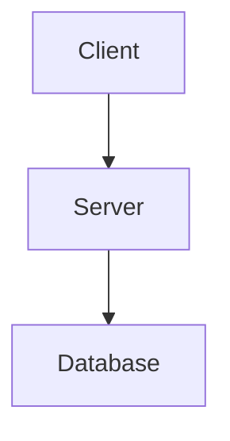

# AI-Powered Software Architect Frontend

A modern, attractive frontend for an AI-powered software architecture design assistant built with React, Vite, and Tailwind CSS.

## ✨ Features

### 🔐 Authentication

- **Google OAuth Integration**: Secure authentication with Google
- Protected routes and session management

### 📁 Project Management

- Create and manage multiple architecture projects
- Organized workspace with project overview
- Easy navigation between projects

### 🏗️ Architecture Design Chat

- **AI-Powered Architecture Generation**: Get comprehensive architecture recommendations
- **Mermaid Diagram Support**: Visualize UML diagrams directly in the chat
- **Prompt Enhancement**: AI-powered prompt enhancement to get more detailed requirements
- **Rich Content Display**:
  - Functional & Non-functional Requirements
  - Architectural Patterns & Styles
  - High-level Architecture Diagrams
  - Technology Stack Recommendations
  - Data & Storage Management
  - Integration & Third-party Services
  - Deployment Strategies

### 🐛 Issues & Q&A Chat

- **Context-Aware Answers**: Automatically includes architecture design context
- Ask questions about your architecture and get expert solutions
- Smart context sharing between Architecture and Issues chats
- Visual indicators showing context availability

### 📝 Rich Text Formatting

- **Bold** and _Italic_ text support
- Code syntax highlighting
- Tables and lists
- Blockquotes and links
- Markdown rendering with proper styling

### 🎨 Modern UI/UX

- Dark theme optimized for long coding sessions
- Smooth animations and transitions
- Responsive design for all screen sizes
- Clean, professional interface

## 🚀 Getting Started

### Prerequisites

- Node.js 18+
- npm or yarn
- A Google OAuth Client ID (for authentication)

### Installation

1. **Clone or navigate to the project directory**:

   ```bash
   cd "d:\Code Projects\front"
   ```

2. **Install dependencies**:

   ```bash
   npm install
   ```

3. **Set up environment variables**:

   Create a `.env` file in the root directory:

   ```bash
   cp .env.example .env
   ```

   Edit `.env` and add your Google Client ID:

   ```env
   VITE_GOOGLE_CLIENT_ID=your-google-client-id-here
   VITE_API_URL=http://localhost:8000
   ```

4. **Start the development server**:

   ```bash
   npm run dev
   ```

5. **Open your browser**:
   Navigate to `http://localhost:3000`

## 🔧 Configuration

### Google OAuth Setup

1. Go to [Google Cloud Console](https://console.cloud.google.com/)
2. Create a new project or select existing one
3. Enable Google+ API
4. Create OAuth 2.0 credentials
5. Add authorized JavaScript origins: `http://localhost:3000`
6. Copy the Client ID and add it to your `.env` file

### Backend API Setup

The frontend is configured to call a backend route `chat.py`. Ensure your backend:

1. Has a `/chat.py` endpoint that accepts POST requests
2. Handles two chat types: `architecture` and `issue`
3. Supports prompt enhancement with `action: 'enhance'`
4. Returns responses in the expected format

**Example Backend Request Format**:

```json
{
  "message": "User's message",
  "projectId": "project-id",
  "chatType": "architecture" | "issue",
  "context": { /* architecture context for issue chats */ },
  "action": "enhance" /* for prompt enhancement */
}
```

## 📦 Project Structure

```
front/
├── src/
│   ├── components/
│   │   ├── Auth/
│   │   │   └── Login.jsx          # Google OAuth login
│   │   ├── Chat/
│   │   │   ├── ArchitectureChat.jsx  # Architecture design chat
│   │   │   └── IssuesChat.jsx        # Issues & Q&A chat
│   │   ├── Common/
│   │   │   └── MessageRenderer.jsx   # Markdown + Mermaid renderer
│   │   ├── Dashboard/
│   │   │   └── Dashboard.jsx      # Project management dashboard
│   │   └── Project/
│   │       └── ProjectView.jsx    # Project detail view with tabs
│   ├── contexts/
│   │   ├── AuthContext.jsx        # Authentication state
│   │   └── ProjectContext.jsx     # Project & context management
│   ├── services/
│   │   └── api.js                 # API service layer
│   ├── App.jsx                    # Main app component
│   ├── main.jsx                   # App entry point
│   └── index.css                  # Global styles + Tailwind
├── index.html
├── package.json
├── vite.config.js
├── tailwind.config.js
└── postcss.config.js
```

## 🎯 Key Features Implementation

### 1. Mermaid Diagram Rendering

Mermaid diagrams are automatically detected and rendered in chat responses:

````markdown

````

```

### 2. Context Sharing

Architecture design context is automatically captured and shared with the Issues chat:

- When you generate an architecture design, the context is saved
- Issues & Q&A chat includes this context in every request
- Visual indicators show when context is available

### 3. Prompt Enhancement

Click the "Enhance" button to:
- Send your prompt to the LLM
- Get a detailed, comprehensive prompt back
- Edit the enhanced prompt before sending
- Get better architecture recommendations

### 4. Text Formatting

All responses support markdown formatting:
- **Bold text** with `**text**`
- *Italic text* with `*text*`
- Code blocks with syntax highlighting
- Tables, lists, and more

## 🛠️ Available Scripts

- `npm run dev` - Start development server
- `npm run build` - Build for production
- `npm run preview` - Preview production build

## 🌐 Browser Support

- Chrome (recommended)
- Firefox
- Safari
- Edge

## 📝 Notes

- The application uses localStorage for demo purposes
- For production, implement proper backend authentication
- Mermaid diagrams require a modern browser with SVG support
- The demo responses are shown when backend is unavailable

## 🤝 Contributing

Feel free to submit issues and enhancement requests!

## 📄 License

This project is licensed under the MIT License.

## 🎨 Tech Stack

- **React 18** - UI framework
- **Vite** - Build tool and dev server
- **Tailwind CSS** - Utility-first CSS framework
- **React Router** - Client-side routing
- **Axios** - HTTP client
- **Mermaid** - Diagram generation
- **React Markdown** - Markdown rendering
- **Lucide React** - Icon library
- **Google OAuth** - Authentication

## 🚨 Troubleshooting

### Issue: Mermaid diagrams not rendering
- Clear browser cache
- Check console for errors
- Ensure proper mermaid code block syntax

### Issue: Google OAuth not working
- Verify Google Client ID in `.env`
- Check authorized origins in Google Console
- Ensure you're using HTTP/HTTPS (not file://)

### Issue: Backend connection failed
- Check `VITE_API_URL` in `.env`
- Ensure backend server is running
- Verify CORS settings on backend

---

**Built with ❤️ for software architects**
```
