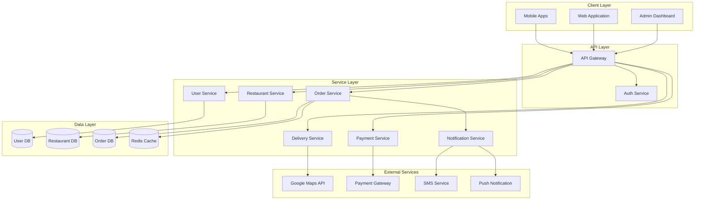
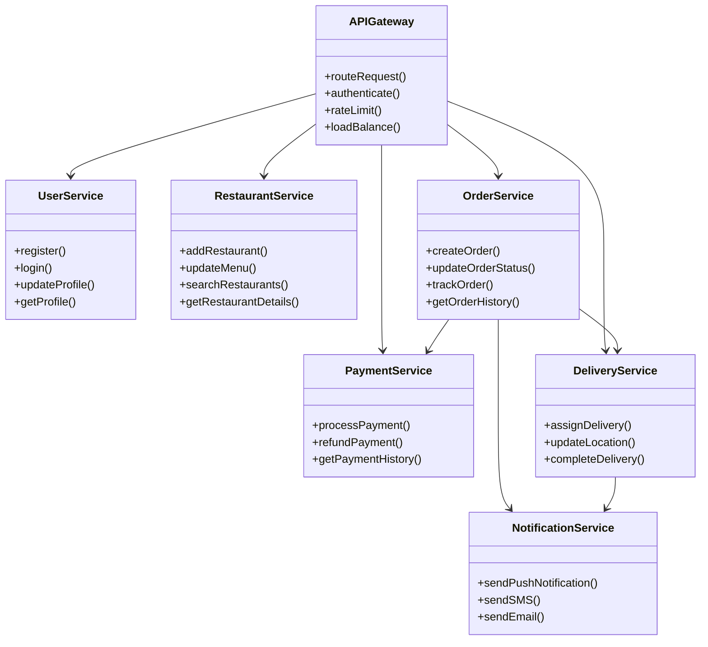
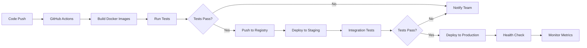
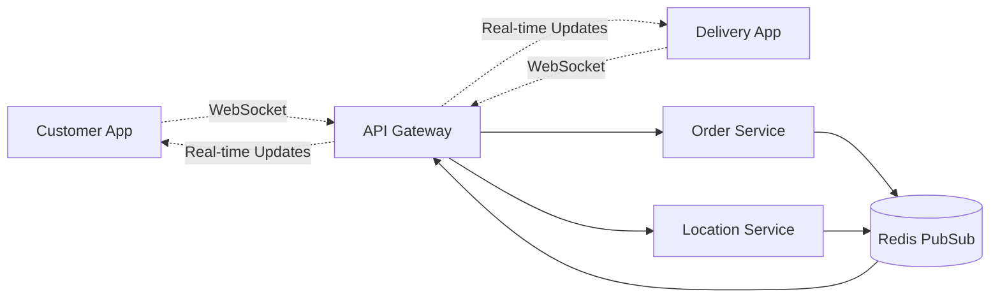

# Complete User Journey Example

This document walks through a complete example of using all features of the AI-Powered Software Architect application.

---

## 🎬 Scene: Building a Food Delivery Platform

### Step 1: Login

**Page:** Login Screen

**Action:** Click "Sign in with Google"

**Result:**

```
✅ Authenticated
→ Redirected to Dashboard
User: John Doe (john@example.com)
```

---

### Step 2: Create Project

**Page:** Dashboard

**Action:** Click "New Project" → Enter "FoodExpress - Delivery Platform"

**Result:**

```
✅ Project created
→ Opened project detail page
Project ID: proj_1732012345
```

---

### Step 3: Start with Basic Prompt

**Page:** Project View - Architecture Design Tab

**Action:** Type in input box:

```
Build a food delivery app
```

**UI State:**

- Input field has text
- "Enhance" button is enabled
- "Send" button is enabled

---

### Step 4: Use Prompt Enhancement

**Action:** Click "Enhance" button

**UI Changes:**

1. "Enhance" button shows spinner
2. Text: "Enhancing..."

**After 2 seconds:**

**Enhanced Prompt Appears in Input:**

```
Design a comprehensive food delivery application supporting
50,000+ daily orders with the following requirements:

**Core Features:**
- User registration and authentication (Google, Email, Phone)
- Restaurant discovery and browsing
- Real-time order tracking with GPS
- Multiple payment options (Credit Card, Digital Wallets, Cash)
- Rating and review system
- Push notifications for order updates
- In-app chat between customer and delivery person

**User Roles:**
- Customers: Browse, order, track, review
- Restaurants: Manage menu, accept orders, update status
- Delivery Partners: Accept deliveries, navigate, update status
- Admin: Manage all users, monitor system, analytics

**Scale Requirements:**
- Support 50,000+ daily orders
- Handle 10,000+ concurrent users
- 100+ restaurants per city
- Multiple city deployment

**Technical Requirements:**
- Real-time order status updates
- GPS tracking integration
- Payment gateway integration
- SMS and push notification service
- Image upload for menu items
- Search and filtering capabilities
- Mobile-first responsive design

**Non-Functional Requirements:**
- Response time < 500ms for search
- 99.9% uptime SLA
- GDPR and data privacy compliance
- PCI DSS for payment processing
- Scalable to 100+ cities

Please provide complete architecture design including:
- System architecture diagrams (Mermaid)
- Component diagrams
- Technology stack recommendations
- Database schema design
- API design
- Deployment strategy
```

**Action:** Review enhanced prompt, maybe edit a bit, then click "Send"

---

### Step 5: Receive Architecture Design

**Action:** Message sent, waiting for response

**UI Shows:**

```
Loading bubble:
🔄 "Generating architecture design..."
```

**After 5-10 seconds:**

**Full Architecture Design Appears:**

---

#### The Response (Formatted with Markdown):

# 🏗️ FoodExpress - Software Architecture Design

## 1. **Functional Requirements**

### Customer Features

- **User Management**: Registration, authentication, profile management
- **Restaurant Discovery**: Search, filter, sort by cuisine, rating, distance
- **Order Management**: Place order, customize items, apply coupons
- **Real-time Tracking**: GPS-based order tracking
- **Payment Processing**: Multiple payment methods
- **Ratings & Reviews**: Rate restaurants and delivery partners

### Restaurant Features

- **Menu Management**: Add/edit/delete items with images and prices
- **Order Processing**: Accept/reject orders, update preparation status
- **Analytics Dashboard**: View sales, ratings, popular items

### Delivery Partner Features

- **Order Assignment**: Accept delivery requests
- **Navigation**: GPS-based route to pickup and delivery
- **Status Updates**: Update pickup/delivery status

### Admin Features

- **User Management**: Manage all user types
- **System Monitoring**: Real-time dashboard with metrics
- **Financial Management**: Commission tracking, payouts

---

## 2. **Non-Functional Requirements**

| Category         | Requirement       | Target                    |
| ---------------- | ----------------- | ------------------------- |
| **Performance**  | API response time | < 500ms (95th percentile) |
| **Performance**  | Search response   | < 200ms                   |
| **Scalability**  | Concurrent users  | 10,000+                   |
| **Scalability**  | Daily orders      | 50,000+                   |
| **Availability** | Uptime            | 99.9%                     |
| **Security**     | Data encryption   | TLS 1.3, AES-256          |
| **Compliance**   | Standards         | PCI DSS, GDPR             |

---

## 3. **Architectural Patterns & Styles**

### Primary Patterns

- **Microservices Architecture**: Independent, scalable services
- **Event-Driven Architecture**: Real-time updates via message queues
- **API Gateway Pattern**: Single entry point for clients
- **CQRS Pattern**: Separate read/write operations for optimization

### Communication Patterns

- **REST APIs**: For CRUD operations
- **WebSocket**: For real-time tracking
- **Message Queue**: For async processing

---

## 4. **High-Level Architecture**



---

## 5. **Component Architecture**



---

## 6. **Technology Stack Recommendations**

### **Backend Services**

- **Framework**: Node.js with NestJS (TypeScript)
- **API**: RESTful + GraphQL for complex queries
- **Real-time**: Socket.io for WebSocket connections
- **Message Queue**: RabbitMQ or Apache Kafka

### **Frontend**

- **Mobile**: React Native (iOS + Android)
- **Web**: React with Next.js (SSR for SEO)
- **State Management**: Redux Toolkit
- **UI Library**: TailwindCSS + Material UI

### **Databases**

- **Primary DB**: PostgreSQL (for relational data)
- **Document Store**: MongoDB (for menu items, reviews)
- **Cache**: Redis (sessions, frequently accessed data)
- **Search Engine**: Elasticsearch (restaurant search)

### **Infrastructure**

- **Cloud**: AWS or Google Cloud Platform
- **Container**: Docker
- **Orchestration**: Kubernetes (EKS/GKE)
- **CI/CD**: GitHub Actions + ArgoCD

### **Monitoring & Logging**

- **Monitoring**: Prometheus + Grafana
- **Logging**: ELK Stack (Elasticsearch, Logstash, Kibana)
- **Tracing**: Jaeger
- **Error Tracking**: Sentry

---

## 7. **Database Schema Design**

### **Key Entities**

**Users Table**

```sql
- id (UUID, PK)
- email (VARCHAR, UNIQUE)
- phone (VARCHAR, UNIQUE)
- name (VARCHAR)
- role (ENUM: customer, restaurant, delivery, admin)
- created_at (TIMESTAMP)
```

**Restaurants Table**

```sql
- id (UUID, PK)
- name (VARCHAR)
- cuisine_type (VARCHAR)
- address (TEXT)
- coordinates (POINT)
- rating (DECIMAL)
- created_at (TIMESTAMP)
```

**Orders Table**

```sql
- id (UUID, PK)
- user_id (UUID, FK)
- restaurant_id (UUID, FK)
- delivery_partner_id (UUID, FK)
- status (ENUM: placed, confirmed, preparing, ready, picked_up, delivered)
- total_amount (DECIMAL)
- created_at (TIMESTAMP)
```

### **Caching Strategy**

- **User Sessions**: Redis (TTL: 24 hours)
- **Restaurant List**: Redis (TTL: 1 hour)
- **Menu Items**: Redis (TTL: 30 minutes)
- **Active Orders**: Redis (real-time updates)

---

## 8. **Integration & Third-party Services**

### **Payment Integration**

- **Primary**: Stripe
- **Alternative**: PayPal, Razorpay
- **Features**: Card payments, digital wallets, webhooks

### **Maps & Location**

- **Provider**: Google Maps API
- **Features**: Geocoding, directions, distance calculation
- **Real-time Tracking**: Google Maps SDK for mobile

### **Communication**

- **Push Notifications**: Firebase Cloud Messaging (FCM)
- **SMS**: Twilio
- **Email**: SendGrid

### **Authentication**

- **Social OAuth**: Google, Facebook
- **Phone Auth**: Firebase Authentication
- **JWT Tokens**: For API authentication

---

## 9. **Deployment Strategy**

### **CI/CD Pipeline**



### **Environment Strategy**

- **Development**: Local Docker Compose
- **Staging**: Kubernetes cluster (1 city)
- **Production**: Multi-region Kubernetes (city-based)

### **Scaling Strategy**

- **Horizontal Pod Autoscaling**: Based on CPU/Memory
- **Database Read Replicas**: For high read loads
- **CDN**: CloudFront for static assets
- **Multi-Region**: Deploy to multiple regions for low latency

---

## 10. **Security Considerations**

### **Authentication & Authorization**

- **JWT Tokens**: Short-lived (15 min) with refresh tokens
- **RBAC**: Role-based access control
- **OAuth 2.0**: For third-party integrations

### **Data Security**

- **Encryption in Transit**: TLS 1.3
- **Encryption at Rest**: AES-256
- **PCI DSS Compliance**: For payment data
- **GDPR Compliance**: User data privacy

### **API Security**

- **Rate Limiting**: 100 requests/min per user
- **Input Validation**: All inputs sanitized
- **SQL Injection Prevention**: Parameterized queries
- **XSS Prevention**: Content Security Policy headers

---

## 11. **Monitoring & Observability**

### **Metrics to Monitor**

- **Business Metrics**: Orders/hour, revenue, conversion rate
- **Technical Metrics**: Response time, error rate, throughput
- **Infrastructure**: CPU, memory, disk, network

### **Alerting Rules**

- **Critical**: API error rate > 5%, DB connection failures
- **Warning**: Response time > 1s, Memory usage > 80%
- **Info**: Unusual traffic patterns, deployment events

### **Dashboards**

- **Business**: Real-time orders, revenue, active users
- **Technical**: Service health, API performance
- **Infrastructure**: Resource utilization, costs

---

## 12. **Cost Optimization**

### **Estimated Monthly Cost (AWS)**

- **Compute** (EKS): $500-800
- **Database** (RDS): $300-500
- **Cache** (ElastiCache): $100-200
- **Storage** (S3): $50-100
- **External APIs**: $200-400
- **Total**: ~$1,150 - $2,000/month (for 50k orders/day)

### **Optimization Strategies**

- Use **spot instances** for non-critical workloads
- **Right-size** resources based on usage
- Implement **caching** to reduce DB queries
- Use **CDN** to reduce bandwidth costs

---

## 📊 Summary

This architecture provides:

- ✅ **Scalability** for 50,000+ daily orders
- ✅ **High Performance** with < 500ms response times
- ✅ **Real-time Features** with WebSocket and message queues
- ✅ **Security** with encryption and compliance
- ✅ **Reliability** with 99.9% uptime
- ✅ **Maintainability** with microservices and clean architecture
- ✅ **Cost-Effective** solution within reasonable budget

---

**Next Steps:**

1. Review and approve architecture
2. Set up infrastructure
3. Begin MVP development
4. Plan rollout strategy

---

#### End of Architecture Design Response

---

### Step 6: Review Architecture

**Page:** Project View - Architecture Design Tab

**What User Sees:**

1. **Formatted Headers** - Large, bold section titles
2. **Bold Text** - **Important points** stand out
3. **Italic Text** - _Emphasis_ on key terms
4. **Rendered Mermaid Diagrams** - Two beautiful diagrams:
   - High-level architecture diagram
   - Component architecture diagram
   - CI/CD pipeline diagram
5. **Code Blocks** - SQL examples with syntax highlighting
6. **Tables** - Clean, bordered tables for requirements
7. **Lists** - Organized bullet points and numbered lists

**Context Saved:**

```javascript
{
  projectId: "proj_1732012345",
  lastUpdate: "2025-11-19T14:30:00Z",
  summary: "Complete architecture for FoodExpress...",
  messages: [
    { role: "user", content: "Enhanced prompt..." },
    { role: "assistant", content: "# Architecture Design..." }
  ]
}
```

---

### Step 7: Switch to Issues & Q&A

**Page:** Project View - Issues & Q&A Tab

**Action:** Click "Issues & Q&A" tab

**UI Changes:**

- Tab switches to orange color
- **Green banner appears:**
  ```
  ✅ Architecture context is available - Your questions
     will have full project context
  ```

**Empty State Shows:**

- Orange alert icon
- "Issues & Q&A Assistant" title
- Example questions
- Note about context availability

---

### Step 8: Ask Context-Aware Question

**Action:** Type in input box:

```
How should I handle real-time order tracking? What's the
best approach for updating customer location in real-time?
```

**Action:** Click "Send"

**UI Shows:**

```
Loading:
🔄 "Analyzing your question with architecture context..."
```

---

### Step 9: Receive Context-Aware Answer

**Response Appears:**

---

# 🔍 Solution: Real-time Order Tracking

> **Note**: This answer is based on your architecture design context from 11/19/2025, 2:30 PM.

## Problem Analysis

Your question about real-time order tracking is crucial for the FoodExpress platform. Based on your existing **microservices architecture with Node.js, PostgreSQL, and Redis**, here's a tailored solution.

## Recommended Approach

### 1. **WebSocket Implementation**

Based on your tech stack (**Socket.io**), implement bidirectional communication:

**Architecture:**



**Implementation:**

```javascript
// Server-side (Node.js with Socket.io)
const io = require("socket.io")(server);

io.on("connection", (socket) => {
  // Customer joins order room
  socket.on("join-order", (orderId) => {
    socket.join(`order-${orderId}`);
  });

  // Delivery partner updates location
  socket.on("update-location", async (data) => {
    const { orderId, lat, lng } = data;

    // Store in Redis for fast access
    await redis.setex(
      `order:${orderId}:location`,
      300, // 5 min TTL
      JSON.stringify({ lat, lng, timestamp: Date.now() })
    );

    // Broadcast to all in order room
    io.to(`order-${orderId}`).emit("location-update", {
      lat,
      lng,
      timestamp: Date.now(),
    });
  });
});
```

### 2. **Redis Pub/Sub Pattern**

Since you're already using **Redis for caching**, leverage it for real-time updates:

**Benefits:**

- **Low Latency**: < 10ms updates
- **Scalability**: Handles thousands of concurrent updates
- **Persistence**: TTL-based storage for recent locations

**Data Structure:**

```javascript
// Redis Key Pattern
order:{orderId}:location = {
  lat: 40.7128,
  lng: -74.0060,
  timestamp: 1700400000000,
  status: 'en_route_to_delivery'
}

// With 5-minute TTL
```

### 3. **Delivery Partner Location Updates**

**Frequency Strategy:**

- **Active Delivery**: Every 10 seconds
- **Idle**: Every 60 seconds
- **On Move**: Distance-based (every 50 meters)

**Mobile App (React Native):**

```javascript
import Geolocation from "@react-native-community/geolocation";

const trackLocation = (orderId) => {
  const watchId = Geolocation.watchPosition(
    (position) => {
      const { latitude, longitude } = position.coords;

      // Send to server via WebSocket
      socket.emit("update-location", {
        orderId,
        lat: latitude,
        lng: longitude,
      });
    },
    (error) => console.error(error),
    {
      enableHighAccuracy: true,
      distanceFilter: 50, // Update every 50 meters
      interval: 10000, // Max 10 seconds
    }
  );
};
```

### 4. **Customer View - Live Map**

**Integration with Google Maps** (from your architecture):

```javascript
import { GoogleMap, Marker, Polyline } from "@react-google-maps/api";

const OrderTrackingMap = ({ orderId }) => {
  const [deliveryLocation, setDeliveryLocation] = useState(null);
  const [route, setRoute] = useState([]);

  useEffect(() => {
    // Listen for real-time updates
    socket.on("location-update", (data) => {
      setDeliveryLocation({
        lat: data.lat,
        lng: data.lng,
      });

      // Update route
      setRoute((prev) => [...prev, data]);
    });

    // Join order room
    socket.emit("join-order", orderId);

    return () => socket.off("location-update");
  }, [orderId]);

  return (
    <GoogleMap center={deliveryLocation} zoom={15}>
      {/* Customer location */}
      <Marker position={customerLocation} icon="customer-pin" />

      {/* Delivery partner location */}
      <Marker position={deliveryLocation} icon="delivery-pin" />

      {/* Route */}
      <Polyline path={route} />
    </GoogleMap>
  );
};
```

## 5. **Scalability Considerations**

For your target of **50,000+ daily orders**:

### **Connection Management**

- Use **Socket.io with Redis adapter** for multi-server setup
- Implement **connection pooling**
- **Horizontal scaling** of WebSocket servers

### **Load Distribution**

```javascript
// Socket.io Redis Adapter
const redisAdapter = require("socket.io-redis");
io.adapter(
  redisAdapter({
    host: "redis-cluster.example.com",
    port: 6379,
  })
);
```

### **Cost Optimization**

- **Geohashing**: Reduce precision for distant deliveries
- **Update Throttling**: Based on customer view state
- **Connection Cleanup**: Auto-disconnect inactive clients

## 6. **Monitoring & Alerts**

**Key Metrics:**

- WebSocket connection count
- Location update frequency
- Redis Pub/Sub latency
- Failed location updates

**Dashboard:**

```
Active Connections: 2,341
Location Updates/sec: 234
Avg Update Latency: 23ms
Failed Updates (1h): 0.02%
```

## Summary

✅ **WebSocket (Socket.io)** for bidirectional communication
✅ **Redis Pub/Sub** for broadcasting updates
✅ **10-second intervals** for active deliveries
✅ **Google Maps integration** for visualization
✅ **Horizontally scalable** with Redis adapter
✅ **Cost-effective** with smart throttling

This solution aligns perfectly with your existing **Node.js + Redis + Google Maps** architecture!

**Need help implementing any specific part? Ask away!**

---

#### End of Context-Aware Response

---

### Step 10: Ask Follow-up Question

**Action:** Type:

```
What about battery optimization for delivery partners?
```

**Result:** Get another context-aware answer that references:

- Your mobile app (React Native)
- Your target scale (50k orders)
- Your existing architecture

---

## 🎉 Journey Complete!

### What We Demonstrated:

1. ✅ **Google Authentication** - Seamless login
2. ✅ **Project Creation** - Easy project management
3. ✅ **Prompt Enhancement** - AI-powered detail generation
4. ✅ **Architecture Design** - Comprehensive response with:
   - **Mermaid Diagrams** (Requirement #1) - Auto-rendered
   - **Bold & Italic** (Requirement #3) - Formatted text
   - Rich markdown content
5. ✅ **Context Sharing** (Requirement #2) - Architecture context in Issues chat
6. ✅ **Context-Aware Answers** - Specific to your architecture

### All Three Requirements in Action:

1. **Mermaid Diagrams** ✅

   - High-level architecture diagram rendered
   - Component diagram rendered
   - CI/CD pipeline diagram rendered

2. **Context Sharing** ✅

   - Green banner showing context available
   - Architecture context sent with issue request
   - Response references specific tech stack

3. **Text Formatting** ✅
   - **Bold** for important points
   - _Italic_ for emphasis
   - Code blocks with highlighting
   - Tables, lists, headings

---

## 💡 Key Takeaways

This example shows:

- **Seamless workflow** from basic idea to detailed architecture
- **Intelligent enhancement** of prompts
- **Visual diagrams** that make architecture clear
- **Context-aware Q&A** that understands your project
- **Professional formatting** that's easy to read

---

**Try it yourself! Start with:**

```bash
npm run dev
```

**Then visit:** `http://localhost:3000`

**Enjoy building with AI! 🚀✨**
